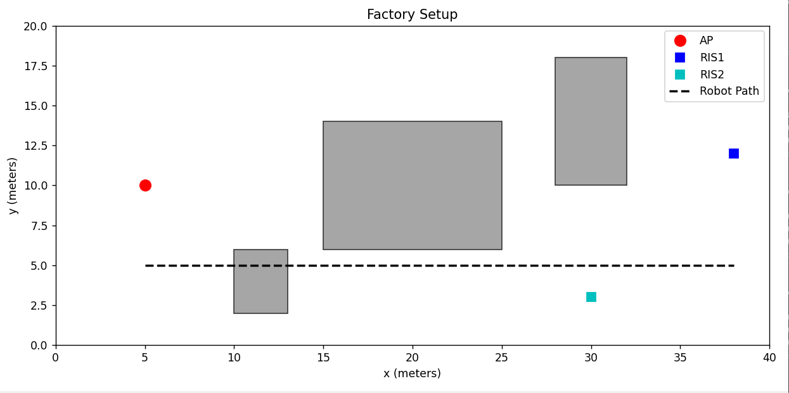
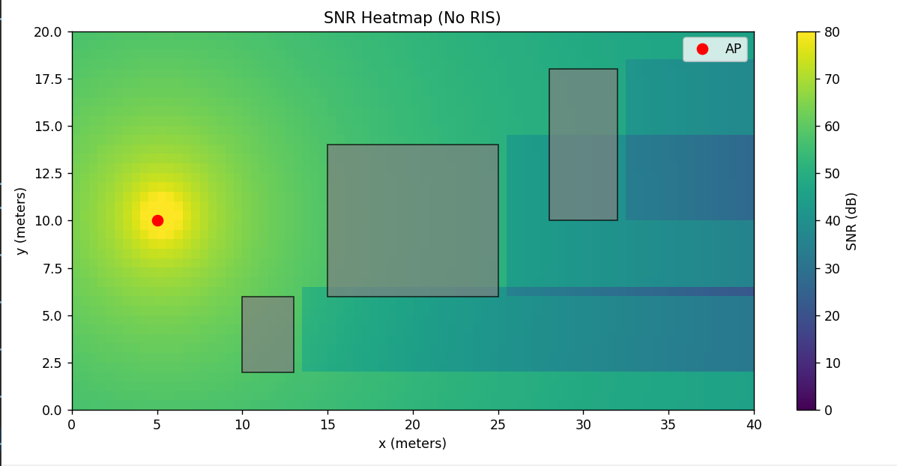
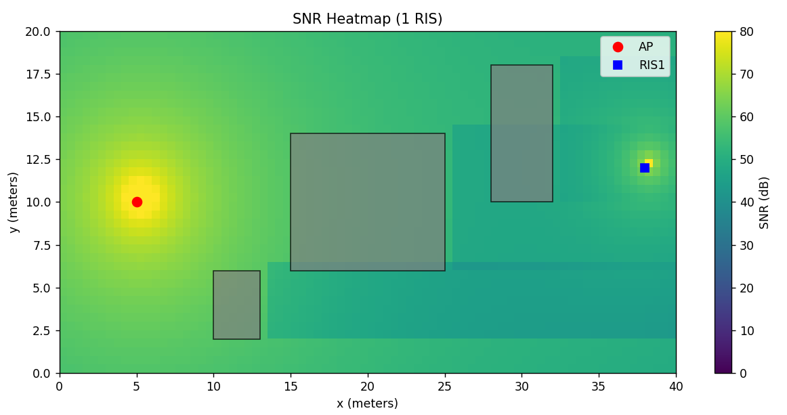
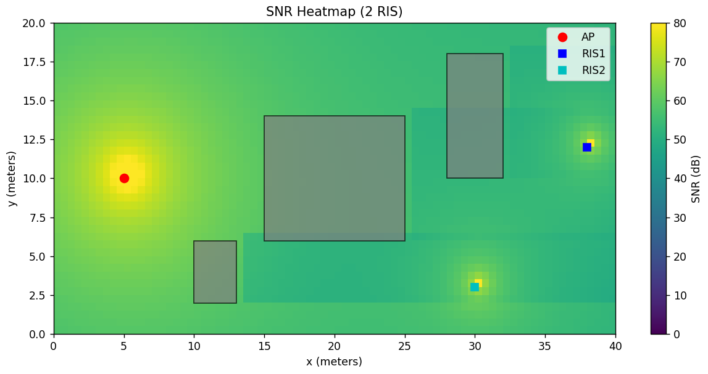
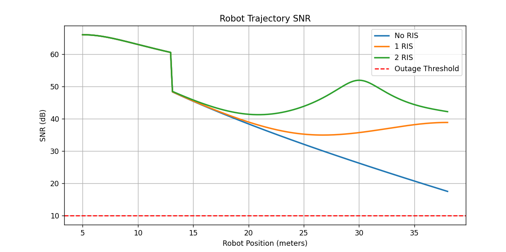

# RIS-Assisted Smart Factory Communication Simulation

## Factory Setup



---


## Overview

This project demonstrates the use of **Reconfigurable Intelligent Surfaces (RIS)** to improve wireless communication reliability in a smart factory environment.

The simulation models:

* A smart factory layout
* Metallic machines causing shadowing and dead coverage zones
* Wireless signal propagation with path loss and Rician fading
* Mobile robot (AGV) communication
* RIS-assisted signal enhancement
* Multi-RIS deployment
* Coverage and outage analysis

The main goal of the project is to study how RIS can improve communication reliability for Industrial IoT (IIoT) and mobile robotic systems operating inside complex factory environments.

---

# Features

## Factory Environment Modeling

The simulation includes:

* Access Point (AP)
* Multiple metallic machines/obstacles
* One or more RIS panels
* A moving robot trajectory

The factory layout is modeled in 2D and includes realistic blockage effects caused by machinery.

---

## Wireless Channel Modeling

The simulation framework includes:

* Distance-dependent path loss
* Rician fading
* Industrial shadowing
* RIS-assisted reflected communication links
* Multi-RIS deployment
* Monte Carlo channel simulation

Detailed mathematical derivations and expressions used in the project are provided separately in the accompanying Expressions PDF.

---

### Rician Fading

The wireless links are modeled using a Rician fading channel:

[
h = \sqrt{\frac{K}{K+1}} + \sqrt{\frac{1}{K+1}}g
]

where:

* (K) = Rician K-factor
* (g \sim \mathcal{CN}(0,1))

This allows the simulation to model:

* LOS propagation
* Reflections from industrial surfaces
* Random multipath fading

---

### Industrial Shadowing Model

Metallic machines introduce additional attenuation.

The simulation includes a cumulative shadowing model where signal attenuation increases deeper into blocked regions.

This creates:

* Dead coverage zones
* Gradual signal degradation
* Spatially varying connectivity

---

## RIS-Assisted Communication

The RIS is modeled as a passive reflective surface consisting of multiple programmable reflecting elements.

The simulation supports:

* Single RIS deployment
* Multi-RIS deployment
* RIS-assisted coverage enhancement
* Cascaded AP → RIS → User communication links
* Coherent reflected signal combining

Detailed RIS mathematical modeling and derivations are included in the Expressions PDF.

---

# Simulations Included

The project generates:

## 1. SNR Heatmaps

Heatmaps showing signal quality across the factory floor under three deployment scenarios:

### No RIS


### Single RIS


### Two RIS Panels


These plots visualize:

* Dead coverage zones created by metallic machinery
* Shadowing regions with severe signal degradation
* Progressive coverage improvement with each additional RIS panel

---

## 2. Robot Trajectory SNR

A mobile robot moves through the factory while the simulation continuously evaluates wireless connectivity along the trajectory.

### SNR vs Robot Position


The trajectory analysis demonstrates:

* Signal degradation behind machinery
* RIS-assisted connectivity recovery
* Reliability improvement for AGVs
* Dynamic coverage variation across the factory

Detailed mathematical formulations are included in the Expressions PDF.

---

## 3. Coverage Probability Analysis

The project evaluates wireless coverage reliability across the factory floor.

Coverage analysis compares:

* No RIS deployment
* Single RIS deployment
* Multi-RIS deployment

The simulation computes coverage probability and outage behavior under different deployment configurations.

Detailed equations and derivations are available in the Expressions PDF.

---

# Project Structure

```text
images/
├── FactorySetup.png
├── NORIS.png
├── ONERIS.png
├── TWORIS.png
└── SNRvsRobotPos.png
```

---

```text
.
├── demo.py
├── README.md
```

---

# How to Run

## Run Animated Demo

```bash
python demo.py
```

The demo visualizes:

* Robot movement
* Signal propagation paths
* RIS-assisted reflected paths
* Live SNR updates

This animation is useful for:

* Project presentations
* Demonstrations
* Explaining RIS concepts visually

---

# Requirements

Install dependencies using:

```bash
pip install numpy matplotlib
```

---

# Example Results

The simulation produces:

* SNR heatmaps (No RIS / One RIS / Two RIS)
* Coverage maps
* Outage contours
* Robot trajectory SNR plots
* Coverage probability comparisons

The results show:

* Metallic machines create severe dead zones
* RIS significantly improves coverage
* Multi-RIS deployment improves reliability further
* AGV communication reliability improves with RIS assistance

---

# Applications

This project is relevant for:

* Smart factories
* Industrial IoT (IIoT)
* Mobile robots and AGVs
* 6G communication systems
* RIS-assisted wireless networks
* Industrial wireless reliability studies

---

# Future Improvements

Possible future extensions include:

* RIS placement optimization
* Dynamic RIS phase adaptation
* Phase quantization
* Imperfect CSI analysis
* Multi-user communication
* OFDM channel modeling
* Real-time AGV trajectory adaptation
* Reinforcement learning-based RIS control

---

# Research Motivation

Industrial environments suffer from:

* Severe shadowing
* Signal blockage
* Connectivity dead zones
* Reliability challenges for mobile robots

RIS technology enables programmable wireless propagation and can significantly improve communication reliability in such environments.

This project investigates RIS-assisted communication enhancement for smart factory applications.

---

# Author
Harsh Modi IMT2023607
Swayam Kotecha IMT2023615
IIIT Bangalore
Developed as part of a Reading Elective under Prof Jyotsana Bapat and under the guidence of Sasirekha ma'am
